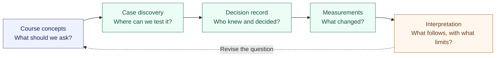

<div align="center">

<sub>ENVR E-119g · SUSTAINABLE CITIES · FALL 2026</sub>

# Cities, resources, and the evidence behind decisions

**A course-grounded research notebook by Mark Banasihan**

[Faculty reading guide](docs/FACULTY-GUIDE.md) · [Course knowledge](cross-course/README.md) · [Case discovery](cases/README.md) · [Research method](METHODOLOGY.md)

</div>

---

> What did an urban institution know when it committed shared resources, what remained uncertain, and what later evidence tested its assumptions?

This repository develops that question through the course’s treatment of institutions, human development, collective action, and natural capital. The working case family is AI and data-center infrastructure. Six places are under investigation; the semester case remains open.

The research follows a decision from evidence and authority through implementation to measurable consequences. An approved project, a contractual promise, and an observed environmental outcome each require different support.

## Research at a glance

| Course foundation | Case discovery | Evidence architecture | Review state |
| :--- | :--- | :--- | :--- |
| Four reading packs; two class packs | Six candidate locations assessed | 34 sources; 56 claims; 44 research objects | Human fidelity gates pending |
| Reading and lecture interpretations kept distinct | One bounded case to be selected | 12 object types; dated evidence access | Assignment 1 drafting paused |

Counts describe the current authored packet, not source completeness. See [build status](BUILD-STATUS.md) and [open limitations](cross-course/omissions.json).

## Follow the inquiry



| To understand… | Open… | What it provides |
| :--- | :--- | :--- |
| The intellectual argument | [Course → research](cross-course/course-to-research.md) | Concepts, mechanisms, tests, rival explanations, and limits |
| Why these six places | [Discovery assessment](cases/DISCOVERY-ASSESSMENT.md) | Comparison and reasons to defer selection |
| How one decision is reconstructed | [The Dalles worked example](cases/worked-example.md) | Authority, timing, competing positions, and a numerical discrepancy |
| How research becomes inspectable | [Research object guide](cases/RESEARCH-OBJECTS.md) | Questions, hypotheses, actors, decisions, measurements, and outcomes |
| What must be learned next | [Research agenda](study/RESEARCH-AGENDA.md) | Retrieval tasks and evidence that could change the analysis |
| How this supports the course | [Course map](COURSE-MAP.md) · [Assignments](assignments/README.md) | Calibration packs and the semester deliverable pathway |

## Six candidates, one eventual case

| Candidate | Decision under investigation | Main unresolved boundary |
| :--- | :--- | :--- |
| [Georgia](cases/candidates/georgia.md) | Large-load utility terms | Connect the state rule to one urban locality |
| [Hawaiʻi](cases/candidates/hawaii.md) | Data-center inquiry and possible local decision | Identify an island, facility, and consequential action |
| [Memphis](cases/candidates/memphis.md) | Initial Paul Lowery electricity-service approval | Recover the contemporaneous approval and conditions |
| [Northern Virginia / Loudoun](cases/candidates/loudoun.md) | Data-center land-use amendments | Separate county zoning from regional power authority |
| [The Dalles, Oregon](cases/candidates/dalles.md) | Water infrastructure agreement authorization | Test supply assurances against the underlying studies |
| [Tucson / Pima County](cases/candidates/tucson.md) | City proposal and subsequent county pathway | Choose one authority and decision in the sequence |

These are discovery candidates. Neither the worked example nor the retrieval order selects a case.

## Evidence that can be challenged

Six evidence classes keep assigned readings, instructor lectures, TA guidance, peer discourse, external context, and our synthesis separate. Claims carry source locators and review status. Research records distinguish event dates, publication dates, and evidence available to a particular actor. Unknown measurements remain unknown.

[Citation policy](CITATION-POLICY.md) · [Writing standard](standards/WRITING.md) · [Research standard](standards/RESEARCH.md) · [AI-use record](AI-USE-LOG.md)

<details>
<summary><strong>Repository map and verification</strong></summary>

```text
modules/        Reading arguments, lecture alignment, class synthesis
cross-course/   Sources, claims, concepts, omissions, review receipts
cases/          Discovery, candidate briefs, linked research objects
study/          Retrieval practice, research agenda, learning records
assignments/    Requirements and preparation, separate from submission prose
standards/      Writing, research, and deliverable rules
docs/          Faculty reading guide
audit/         Reconciliation, source discovery, and change records
schemas/        Machine-readable contracts
scripts/        Validation, privacy, ingestion, and status checks
private/        Ignored local archive; never committed
```

Install `requirements-dev.txt`, then run:

```sh
python3 scripts/validate.py --schemas
python3 -m unittest discover -s tests
python3 scripts/privacy_check.py
python3 scripts/status.py
```

Use `--local` to check archived source digests. Install hooks with `git config core.hooksPath .githooks`. Passing checks establishes structural consistency; human review establishes whether used claims faithfully represent their sources.

</details>

---

<sub>Private working repository. Authored research is organized for eventual faculty review. Raw course materials, transcripts, screenshots, and conversations stay in the ignored archive. No faculty access or publication is implied.</sub>
