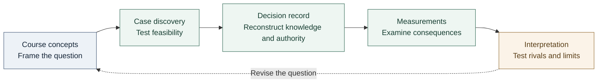

<div align="center">

<sub>ENVR E-119g · SUSTAINABLE CITIES · FALL 2026</sub>

# Cities, resources, and public decisions

**A course-grounded research notebook · Mark Banasihan**

[Course knowledge](cross-course/README.md) · [Case discovery](cases/README.md) · [Methodology](METHODOLOGY.md) · [AI governance](governance/README.md)

</div>

---

> **Working question**
> What did an urban institution know when it committed shared resources, what remained uncertain, and what later evidence tested its assumptions?

AI and data-center infrastructure provide the working case family. The course supplies competing ways to examine institutions, human development, collective action, and ecological limits. The research connects those ideas to a bounded decision, its affected populations, and evidence that could change the interpretation.

| Research stage | Review state | Deliverable boundary |
| :--- | :--- | :--- |
| Six candidates; geography open | Human fidelity reviews pending | Assignment 1 drafting paused |

[Current status and limitations](BUILD-STATUS.md) · [Faculty reading guide](docs/FACULTY-GUIDE.md)

**For the September 18 memorandum:** start with the [Assignment 1 evidence packet](assignments/assignment-01/EVIDENCE-PACKET.md). It connects the user's stated background with focused claims, exact locators, competing interpretations and a 900-word argument plan. Source review and drafting remain separate next steps.

## Start with the work

| Explore | Open | What to inspect |
| :--- | :--- | :--- |
| **The intellectual foundation** | [Course knowledge](cross-course/README.md) | Reading arguments, lecture distinctions, and unresolved tensions |
| **The research design** | [Methodology](METHODOLOGY.md) | Questions, competing explanations, evidence needs, and stopping rules |
| **The choice of case** | [Discovery assessment](cases/DISCOVERY-ASSESSMENT.md) | Primary-record richness, decision traceability, and selection limits |
| **A reconstructed decision** | [The Dalles worked example](cases/worked-example.md) | Authority, evidence timing, alternatives, and a numerical discrepancy |
| **The next consequential tests** | [Research agenda](study/RESEARCH-AGENDA.md) | Missing records and findings that could alter the analysis |
| **Accountability for AI assistance** | [Governance and evaluation](governance/README.md) | Permitted work, review responsibilities, tests, and remaining limitations |

## From course concepts to an answer



Each step produces something a reader can inspect. [Research objects](cases/RESEARCH-OBJECTS.md) connect questions and hypotheses to actors, authority, timelines, evidence, measurements, contradictions, alternatives, and outcomes. A permission, a forecast, and a measured result retain their distinct meanings.

## Six places under investigation

| Candidate | Decision focus | Evidence gap that matters |
| :--- | :--- | :--- |
| [Georgia](cases/candidates/georgia.md) | Large-load utility terms | Connect the state rule to one urban locality |
| [Hawaiʻi](cases/candidates/hawaii.md) | Data-center inquiry and a possible local decision | Establish an island, facility, and consequential action |
| [Memphis](cases/candidates/memphis.md) | Initial Paul Lowery electricity-service approval | Recover contemporaneous approval and conditions |
| [Northern Virginia / Loudoun](cases/candidates/loudoun.md) | Data-center land-use amendments | Separate county zoning from regional power authority |
| [The Dalles, Oregon](cases/candidates/dalles.md) | Water infrastructure agreement authorization | Test supply assurances against underlying studies |
| [Tucson / Pima County](cases/candidates/tucson.md) | City proposal and subsequent county pathway | Bound one decision within the sequence |

The worked example demonstrates the method. Case selection still requires the [selection protocol](cases/SELECTION-PROTOCOL.md).

## Read, check, and build

| Reader's task | Reference |
| :--- | :--- |
| Locate a class or assignment | [Course map](COURSE-MAP.md) · [Assignment preparation](assignments/README.md) |
| Trace a statement to its source | [Citation policy](CITATION-POLICY.md) · [Claim registry](cross-course/claims.json) |
| Assess reasoning and presentation | [Research standard](standards/RESEARCH.md) · [E5 writing](standards/WRITING.md) · [Markdown design](standards/MARKDOWN.md) |
| Understand AI's contribution | [AI-use record](AI-USE-LOG.md) · [Evaluation](governance/EVALUATION.md) |

<details>
<summary><strong>Repository map and technical verification</strong></summary>

| Directory | Contents |
| :--- | :--- |
| `modules/` | Reading analyses, lecture alignment, and class synthesis |
| `cross-course/` | Canonical sources, claims, concepts, omissions, and review receipts |
| `cases/` | Discovery assessments, candidate briefs, and research objects |
| `study/` | Retrieval practice, research agenda, and learning records |
| `assignments/` | Requirements and preparation for the semester inquiry |
| `governance/` | AI-use responsibilities, assurance, and evaluation |
| `standards/` | Research, writing, presentation, and deliverable rules |
| `audit/` | Source discovery, reconciliation, and change records |
| `schemas/`, `scripts/`, `tests/` | Data contracts and repeatable checks |
| `private/` | Ignored local source archive; never committed |

Install `requirements-dev.txt`, then run:

```sh
python3 scripts/validate.py --schemas
python3 -m unittest discover -s tests
python3 scripts/privacy_check.py
python3 scripts/status.py
```

Use `--local` with validation to check archived source digests. Install hooks with `git config core.hooksPath .githooks`. Automated checks establish record consistency within their scope. Human review must establish whether a claim faithfully represents its source.

</details>

---

<sub>Private working repository. Authored research is prepared for eventual faculty review. Raw readings, recordings, screenshots, and conversations remain in the ignored archive. No instructor endorsement, faculty access, or submission is implied.</sub>
