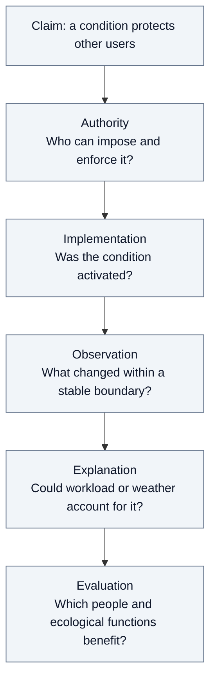

# From course arguments to empirical questions

[Home](../README.md) / [Course knowledge](README.md) / Course → research

An infrastructure approval can be procedurally documented and still leave its consequences unknown. The first two classes separate the questions needed to evaluate it. The table is our synthesis of inspected claims, with each application open to revision.

| Course contribution | Question it changes | Evidence needed | Rival explanation or limit |
| :--- | :--- | :--- | :--- |
| North: rules and enforcement (`N-02`) | Who can commit resources and enforce conditions? | Operative instrument, delegation, contract, enforcement record | A rule may exist without enforcement |
| North: institutional learning (`N-03`); Nora: switching costs (`L1-02`) | Which inherited commitment makes an alternative costly? | Dated investment, contract, rejected alternatives, transition costs | Persistence may reflect current technical advantage |
| Sen: plural evaluation (`S-01`–`S-03`) | Whose benefits count, and who can contest their weights? | Disaggregated outcomes, testimony, explicit valuation choices | More indicators can still conceal a value judgment |
| Nora: capabilities (`L1-03`) | What can affected people actually do to respond? | Information access, representation, services, feasible alternatives | Participation counts do not establish meaningful influence |
| Ostrom: conditional cooperation (`O-01`, `O-04`) | Under which conditions will actors cooperate? | Repeated interaction, communication, verified adherence | A laboratory finding cannot estimate a utility agreement’s effect |
| Ostrom: monitoring and sanctions (`O-02`) | Can someone detect deviation and act on it? | Triggers, meter records, inspections, responses | Demand may fall because workload or weather changes |
| Costanza and Daly: natural capital (`CD-01`, `CD-04`) | Which stock or assimilative function constrains the project? | Aquifer balance, recharge, withdrawals, return flows | Annual water volume cannot establish long-run aquifer condition |
| Costanza and Daly: valuation (`CD-05`) | How does the time horizon change the assessment? | Discount assumptions and sensitivity analysis | Calculation cannot settle the normative choice of discount rate |
| Nora: outputs and outcomes (`L2-03`) | Did a condition change the physical result? | Implementation dates and comparable observations | Authorization is an output; causation needs a comparison |

## One reasoning chain

Suppose a utility agreement promises that new industrial demand will preserve other users’ water supply. North motivates inspecting authority and obligations. Ostrom motivates inspecting whether compliance is observable and a violation produces a response. Costanza and Daly motivate testing the physical stock and regeneration assumptions. Sen motivates asking whether an acceptable outcome includes affected households and their ability to challenge the decision.

This chain generates research questions. It supplies no answer about a particular city. In the [The Dalles example](../cases/worked-example.md), the record contains a vote and competing positions, while the studies and comparable measurements remain to be acquired. That gap prevents a conclusion about water security.

## Three tensions to preserve

**Predictability and revision.** A long contract can make investment possible and make later adjustment expensive. Identify the mechanism on both sides: which risk it allocates, who bears forecast error, and which clauses permit correction. Duration alone establishes neither good governance nor harmful lock-in.

**Plural evaluation and ecological limits.** Public reasoning can expose disagreements about jobs, revenue, access, and protection. A negotiated preference does not establish that an aquifer can sustain a withdrawal rate. Keep the empirical constraint separate from the normative judgment about acceptable distribution.

**Transparency and effective action.** Disclosure may improve scrutiny without changing a decision. Trace whether information reached someone with authority, changed an option or condition, and affected implementation. An information-access gap can become a question, but an unsuccessful search is insufficient evidence of concealment.

## Instructor and TA guidance changes selection

Nora supports a case, place, and time that develops through the semester (`L2-05`, L2 1:12:36–1:14:07). She connects familiarity to detecting AI errors (`L2-06`, 1:44:48–1:46:16) and permits a small real case (`L2-07`, 1:47:00–1:47:12). Cristina asks for personal interest, current evidence, and further questions (`TA-01`, 1:37:53–1:41:19), with focused theme, context, and time (`TA-04`, 1:43:24–1:44:48).

Our protocol asks whether a candidate supports a bounded inquiry that Mark can understand and revisit. Six candidates serve discovery; six complete studies would exceed the intended single-case design. These operational choices are our synthesis, not additional course requirements.

## Fidelity limits

All IDs resolve in the [claim registry](claims.json). New extracted-text checks cover `CD-04` (PDF p. 9, printed p. 44), `CD-05` (PDF p. 8, printed p. 43), and `O-04` (supplied working paper, PDF p. 12). Existing North claims remain a visually inspected subset. No full-source coverage is claimed.

The supplied Ostrom item is a 2008 working paper corresponding to the assigned *Building Trust to Solve Commons Dilemmas* chapter. The prior conversation cites *A General Framework for Analyzing Sustainability of Social-Ecological Systems*, a different work. It is not substituted for the course reading. North’s reprint and assigned AER pagination also remain distinct. Human review and lecture speaker verification remain pending.
