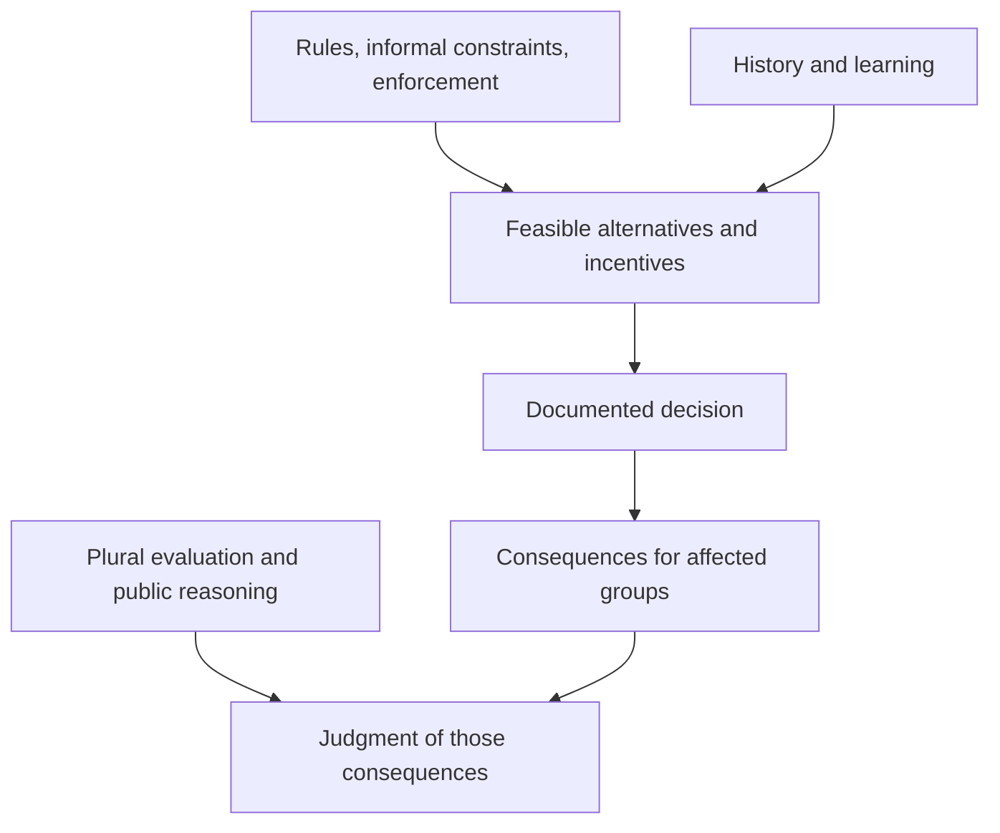

# Class 01 · from concepts to inquiry

[Class overview](../README.md) · [Comparison](north-sen-comparison.md)

The diagram organizes questions. Its arrows are proposed analytical relationships, not estimated causal effects.

| Concept | Source anchor | Observable question |
| :--- | :--- | :--- |
| Institutions | `N-02`, PDF p. 2 | Which rule is operative, and who can enforce or change it? |
| Learning and persistence | `N-03`, PDF pp. 2, 5 | Which earlier commitment still affects the alternatives? |
| Plural evaluation | `S-01`, PDF pp. 5–6 | Which important consequence is missing from the headline indicator? |
| Public reasoning | `S-03`, PDF p. 6 | What reasons and objections were available before commitment? |
| Jurisdictional scale | `L1-04`, L1C 08:33–11:28 | Does the approving authority govern the affected physical system? |
| Distribution | `L1-05`, L1E 03:56–06:36 | Who can ask others to bear a cost, and with what justification? |

**Missing link to test:** a formal power does not prove actual influence, and an observed outcome does not prove that the decision caused it. The [application design](urban-application.md) makes both gaps explicit.
