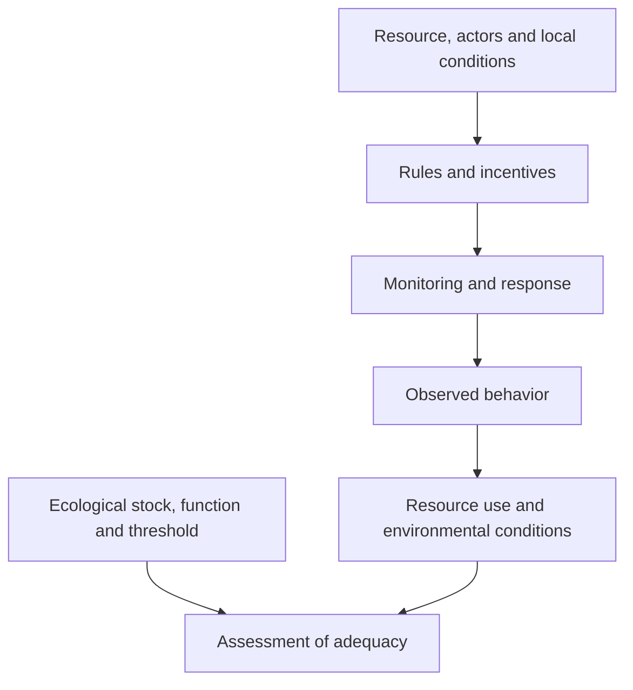

# Class 02 · from an agreement to an outcome

[Class overview](../README.md) · [Tensions](tensions-and-complements.md)

This map separates the behavior an institution seeks from the physical consequence used to judge it. Arrows show the proposed inquiry, not proven causal effects.

| Link to investigate | Source anchor | Evidence needed |
| :--- | :--- | :--- |
| Conditions → cooperation | `O-03`, PDF p. 26; `O-04`, p. 12 | Resource boundary, actor incentives and repeated interaction. |
| Monitoring → response | `O-02`, PDF p. 25 | Observation, breach and corrective-action records. |
| Activity → resource demand | `CD-02`, PDF p. 6 | Activity and intensity measured consistently. |
| Resource use → ecological adequacy | `CD-01`, PDF p. 3; `CD-04`, p. 9 | Stock/function measures and local capacity estimate. |
| Delivered action → consequence | `L2-03`, L2 1:27:11–1:29:31 | Implementation record and separately measured outcome. |

## Most vulnerable inference

A decline after a rule takes effect can have several causes. Weather, production levels, relocation or measurement changes may explain the pattern. The [urban application](urban-application.md) requires these alternatives to remain visible before attributing the decline to monitoring or enforcement.
